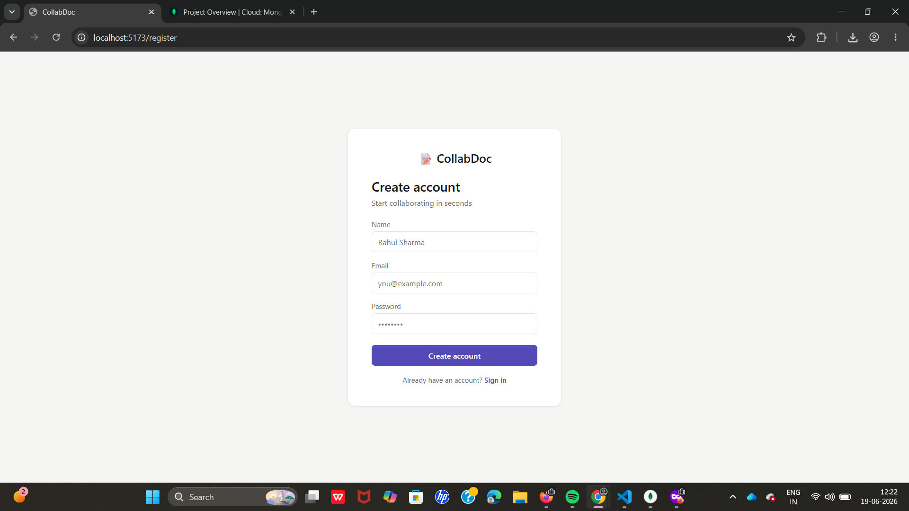
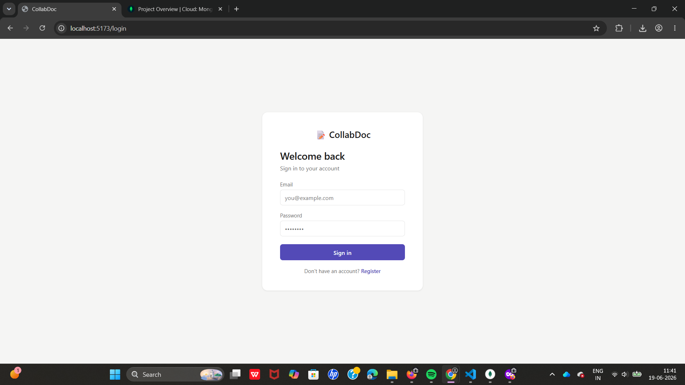
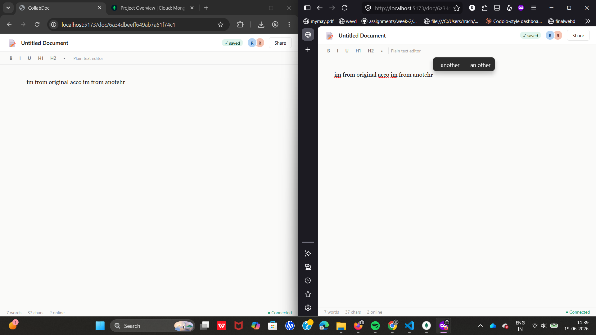
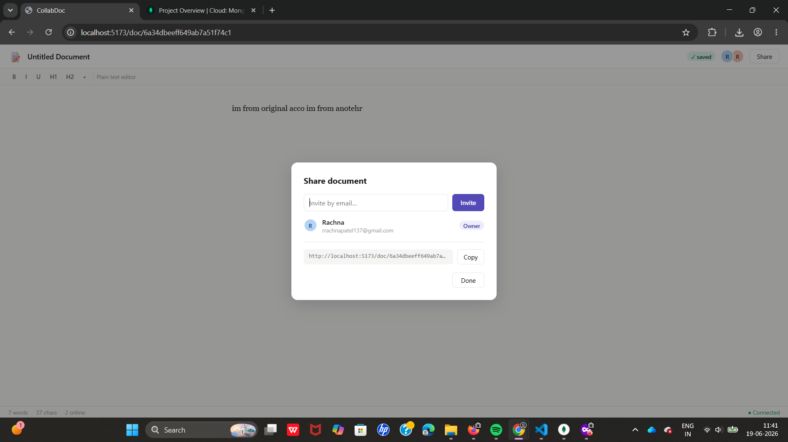

# 📝 CollabDoc — Real-Time Collaborative Editor

A full-stack real-time document collaboration app built with React, Node.js, Socket.io, and MongoDB.

## 🔥 Features
- Real-time collaborative editing with WebSockets
- JWT authentication (register / login)
- Create, edit, delete documents
- Invite collaborators by email
- Live presence — see who's online
- Auto-save every 2 seconds
- Share document link

## 🛠 Tech Stack
| Layer | Tech |
|-------|------|
| Frontend | React (Vite), React Router, Axios |
| Backend | Node.js, Express, Socket.io |
| Database | MongoDB + Mongoose |
| Auth | JWT + bcryptjs |
| Validation | Zod |

## 📁 Project Structure
```
collabdoc/
├── server/
│   ├── models/       # User.js, Document.js
│   ├── routes/       # auth.js, docs.js
│   ├── middleware/   # auth.js (JWT verify)
│   └── index.js      # Express + Socket.io entry
└── client/
    └── src/
        ├── pages/    # Login, Register, Home, Editor
        ├── App.jsx
        └── api.js    # Axios instance
```

## 📸 Snapshots






## 🚀 Setup Instructions

### 1. MongoDB Atlas
- Go to https://cloud.mongodb.com
- Create a free cluster
- Get your connection string

### 2. Server
```bash
cd server
npm install
cp .env.example .env
# Fill in MONGO_URI and JWT_SECRET in .env
npm run dev
```

### 3. Client
```bash
cd client
npm install
npm run dev
```

Open http://localhost:5173

## 🆕 What changed in this version

See [`CHANGES.md`](./CHANGES.md) for the full list — summary: fixed a
leaked `.env`, fixed a production API-URL bug, added socket-level auth,
per-document authorization, rate limiting, live cursors (completed),
version history (wired up), optional Redis scaling for Socket.IO,
Docker support, and an AI-assisted change-summary feature.

## 🐳 Running with Docker (local dev)

```bash
cp server/.env.example server/.env
# fill in MONGO_URI (Atlas) and JWT_SECRET in server/.env
docker compose up --build
```
Backend runs at `http://localhost:5000` with Redis wired up automatically
(`REDIS_URL` is set for you inside `docker-compose.yml`). Run the client
separately with `cd client && npm install && npm run dev` — it isn't
containerized since Vite's dev server is already fast for local work.

## 🤖 AI change summaries

Click **History → Summarize latest changes (AI)** in the editor to get a
plain-English summary of the most recent edit. Works two ways:
- **With `OPENAI_API_KEY` set** (in `server/.env` or your Render env vars):
  uses `gpt-4o-mini` to generate the summary.
- **Without it**: falls back automatically to a heuristic word-diff
  summary — no external calls, no cost, still functional.

## 🌐 Deployment

### Backend → Render.com

1. Push this repo to your own GitHub (see "Getting this onto GitHub" below).
2. On [render.com](https://render.com) → New → Web Service → connect your repo.
3. **Root directory:** `server`
4. **Build command:** `npm install`
5. **Start command:** `npm start`
6. Add environment variables (Settings → Environment):
   - `MONGO_URI` — your MongoDB Atlas connection string
   - `JWT_SECRET` — a new random secret (see "Rotate your secrets" in CHANGES.md)
   - `CLIENT_URL` — your Vercel frontend URL, e.g. `https://your-app.vercel.app`
   - `REDIS_URL` — optional, only if you've set up Redis (see below)
   - `OPENAI_API_KEY` — optional, enables AI-generated change summaries (see below)
7. Deploy. Copy the resulting URL, e.g. `https://collabdoc-server.onrender.com`.

### (Optional) Redis for Socket.IO scaling

- On Render: New → Redis (or use [Upstash](https://upstash.com)'s free tier).
- Copy the connection URL and set it as `REDIS_URL` on your backend service.
- Redeploy — logs will show `Socket.IO Redis adapter connected`. You only
  need this once you run more than one backend instance.

### Frontend → Vercel

1. On [vercel.com](https://vercel.com) → New Project → import your repo.
2. **Root directory:** `client`
3. **Build command:** `npm run build` · **Output directory:** `dist`
4. Environment variable: `VITE_SERVER_URL` = your Render backend URL (no trailing slash)
5. Deploy.

### Getting this onto GitHub

```bash
cd Myrealtimeeditor
git init
git add .
git commit -m "CollabDoc: live cursors, version history, socket auth, Redis scaling"
git branch -M main
git remote add origin https://github.com/<your-username>/collabdoc.git
git push -u origin main
```

Rotate your MongoDB password and JWT secret regardless of whether you
push this as a new repo or reuse the old one — see `CHANGES.md`.

## 💡 How Real-Time Sync Works
1. User types → frontend emits `send-changes` with new content over WebSocket
2. Server receives it → broadcasts `receive-changes` to all others in the same document room
3. Other clients receive it → update their textarea instantly
4. Every 2 seconds → `save-doc` event persists content to MongoDB
